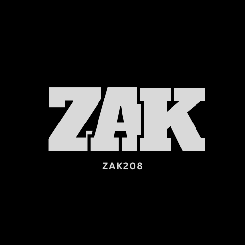

<p align="center"></p>

<h1 align="center">Zak_light</h1>

**Iluminación ambiental para tu monitor, ligera y sin ataduras.** Zak_light controla la tira LED USB que va detrás del
monitor (controlador QinHeng/ROBOBLOQ, VID `0x1A86`, PID `0xFE07`) y la hace seguir la imagen de la pantalla, el ritmo de
la música o una animación. Es un reemplazo completo de *DX Light*: habla directamente con el dispositivo, consume una
fracción de los recursos y no necesita internet.


---

## Índice

1. [Qué puede hacer](#qué-puede-hacer)
2. [Instalación](#instalación)
3. [Primeros pasos](#primeros-pasos)
4. [Uso diario](#uso-diario)
5. [Línea de comandos](#línea-de-comandos)
6. [Consumo](#consumo)
7. [Cómo funciona](#cómo-funciona)
8. [Desarrollo](#desarrollo)
9. [Privacidad y seguridad](#privacidad-y-seguridad)
10. [Problemas frecuentes](#problemas-frecuentes)

---

## Qué puede hacer

### Cuatro modos

| Modo | Qué hace |
|---|---|
| 🖥️ **Pantalla** | Cada LED toma el color de la zona de imagen que tiene delante. Tres formas de repartir la imagen, explicadas con dibujos en la app: **Bordes** (el más fiel), **Ambiente** (un único color medio, muy suave) y **Mitades**; solo se ofrecen los lados en los que tienes LED. Detecta las bandas negras de las películas, tiene presets *Juego / Película / Vívido / Suave* y puede hacer latir la tira con los graves. |
| 🎵 **Ritmo** | Escucha lo que suena en tu PC (sin micrófono) y separa graves, medios y agudos. 10 patrones —incluidos *VU estéreo* y *Espectro perimetral*— y 6 paletas. Se adapta al volumen solo. |
| ✨ **Efectos** | 18 animaciones en dos grupos: **Ambiente** (aurora, lámpara de lava, olas, vela, estrellas, amanecer, arcoíris, respiración, fuego, ciclo, plasma) y **Espectáculo** (cometa, scanner, fuegos artificiales, policía, tormenta, persecución, ondas). Velocidad, dirección y espejo, y cada efecto recuerda sus propios colores (la policía es roja y azul, el scanner rojo…), con un botón para volver a los originales. |
| 🎨 **Color** | Un solo color para toda la tira, con selector, código hexadecimal y temperatura de blanco. |

### Calidad de luz

Balance de blancos por canal, resplandor cálido cuando la pantalla es negra, límite de potencia para proteger la fuente
USB, difuminado de color (más matices en tonos oscuros), suavizado que reacciona al instante en los cortes de escena y
fundidos al cambiar de modo. Gamma, saturación y brillo se ajustan en vivo.

### Comodidad y automatización

- **Reglas por aplicación:** al abrir un juego o un reproductor cambia de modo o de perfil solo, y al cerrarlo vuelve a lo anterior.
- **Horarios y despertador:** enciende, apaga o cambia de ambiente a una hora; el *amanecer* sube la luz poco a poco.
- **Apagado por inactividad**, que no actúa mientras suene audio.
- **Atajos globales** que funcionan también dentro de juegos (ver [Uso diario](#uso-diario)).
- **Perfiles con nombre** (brillo, colores, ritmo, efectos…); la interfaz marca cuál está activo. No tocan el cableado ni las zonas.
- **Asistente de la tira:** descubre el orden de colores y el sentido de los LED con unas pruebas sencillas.
- **Copia de seguridad:** exporta e importa todos tus ajustes y perfiles en un archivo.
- **Avisos en la bandeja** si se corta el USB, otro programa pelea por la tira o la captura deja de responder.
- La tira se **apaga sola** al bloquear la sesión, apagar la pantalla o suspender el PC, y vuelve después. Si desenchufas el USB, se reconecta sola.

### Rendimiento y fiabilidad

- **Eco / Equilibrado / Fluido** (20 / 40 / 60 FPS) para elegir entre consumo y suavidad sin tocar ajustes técnicos.
- **Diagnóstico en vivo** en la app: FPS de captura, latencia, escrituras USB, fallos y estado del capturador; informe exportable sin datos personales.
- **Captura a prueba de bloqueos:** vive en un proceso aparte que se reinicia solo si Windows deja la captura colgada
  (bloqueo de sesión, juego en pantalla completa exclusiva, reinicio de GPU) y al instante si cambias de resolución o de monitor.
- Detecta si **DX Light** u otro programa está controlando la misma tira y ofrece cerrarlo.

---

## Instalación

**Antes de empezar:** Windows 10 u 11, la tira conectada por USB y *DX Light* cerrado (solo un programa puede controlar la tira a la vez).

Hay tres caminos; elige el que te encaje:

| | Para quién | Necesitas |
|---|---|---|
| **A. Descargar el instalador** | Quien solo quiere usar la app | Nada más |
| **B. Crear el instalador tú mismo** | Quien ha descargado el código y no hay instalador hecho | Python 3.12 |
| **C. Probarlo sin instalar** | Quien quiere verlo o desarrollar | Python 3.12 |

### A. Descargar el instalador

1. Entra en [**Releases**](https://github.com/Zak208/Zak_Light/releases) y descarga `Zak_light_Setup.exe` de la última versión.
2. Haz doble clic en el archivo. Si Windows avisa de que es de un editor desconocido, pulsa *Más información → Ejecutar de todas formas* (el instalador no está firmado digitalmente).
3. Sigue el asistente, en español:
   1. **Para quién instalar:** solo para ti (sin permisos de administrador) o para todos los usuarios del PC.
   2. **Dónde instalar el programa** (por defecto, `%LOCALAPPDATA%\Programs\Zak_light`).
   3. **Iniciar con Windows**, en segundo plano, al encender el PC (viene marcado).
   4. Un resumen y **Instalar**. Al terminar, deja marcada la opción *Abrir Zak_light*.
4. Listo: el acceso directo está en el **escritorio** (y en el menú Inicio) y el icono aparece en la bandeja del sistema, junto al reloj.

### B. Crear el instalador tú mismo

1. **Descarga el código:** en GitHub, *Code → Download ZIP* y descomprímelo; o con git: `git clone https://github.com/Zak208/Zak_Light.git`.
2. **Instala [Python 3.12](https://www.python.org/downloads/)** y marca *Add python.exe to PATH* durante la instalación.
3. **Haz doble clic en `crear_instalador.bat`** (está en la carpeta principal, junto a `iniciar.bat`). Él solo:
   - instala las librerías que necesita y **Inno Setup**, el programa que crea instaladores (con `winget`; Windows puede pedirte permiso);
   - pasa la revisión y las pruebas;
   - empaqueta la app. Tarda unos minutos.
4. Cuando termine verás el mensaje *Listo*, y **`Zak_light_Setup.exe`** aparecerá en esa misma carpeta.
5. Haz doble clic en `Zak_light_Setup.exe` y continúa como en el camino A, desde el paso 3.

### C. Probarlo sin instalar

1. Descarga el código y instala Python 3.12 (pasos 1 y 2 del camino B).
2. Haz doble clic en **`iniciar.bat`**. La primera vez instala las librerías que falten; después abre la app.
   Deja abierta la ventana de texto mientras la uses: muestra los mensajes del programa.
   (O, a mano: `pip install -r src/requirements.txt` y `python src/app.py`.)

En este modo tus ajustes se guardan en la carpeta `data/` del proyecto, y la app **no** arranca con Windows: para eso hay que instalarla (A o B).

### Actualizar y desinstalar

- **Actualizar:** ejecuta el instalador nuevo encima. Cierra la versión anterior (apagando antes los LED) y conserva tus ajustes.
- **Desinstalar:** *Configuración de Windows → Aplicaciones → Zak_light*, o `unins000.exe` en la carpeta de instalación. Te pregunta si quieres borrar también tus ajustes.
- **Tus datos** (ajustes, perfiles y registro) están en `%APPDATA%\Zak_light`.

---

## Primeros pasos

1. **Conecta la tira por USB** y cierra *DX Light* si estaba abierto: solo un programa puede controlar el dispositivo.
2. Abre Zak_light. Verás una vista previa con los colores reales de la tira y cuatro modos.
3. Si al pedir rojo sale otro color, abre **Ajustes → Asistente de la tira** y sigue los pasos (3 pruebas de color y 1 de sentido).
4. Ajusta el **reparto de LED por lado** en *Zonas de la pantalla* si tu tira no coincide con el reparto automático.

---

## Uso diario

La app vive en la **bandeja del sistema**. Su icono toma el color que muestra la tira. El menú permite encender o
apagar, cambiar de modo, fijar el brillo, cargar un perfil y abrir la ventana. La ventana se puede cerrar: el motor sigue
funcionando y la memoria de la ventana se libera. En *Ajustes → Sistema* puedes hacer que se cierre sola tras un rato sin usarla.

### Atajos

| Atajo | Acción |
|---|---|
| `Ctrl+Alt+L` | Encender / apagar (global) |
| `Ctrl+Alt+→` / `Ctrl+Alt+←` | Modo siguiente / anterior (global) |
| `Ctrl+Alt+↑` / `Ctrl+Alt+↓` | Más / menos brillo (global) |
| `Espacio` | Encender / apagar (en la ventana) |
| `1` `2` `3` `4` | Pantalla, Ritmo, Efectos, Color (en la ventana) |
| `+` / `−` | Brillo (en la ventana) |
| `,` / `Esc` | Abrir Ajustes / volver (en la ventana) |

Los atajos globales se pueden desactivar en *Ajustes → Atajos globales y avisos*.

---

## Línea de comandos

Sirven para accesos directos, tareas programadas o atajos de otros programas. Necesitan el motor en marcha.

```
Zak_light.exe --set-mode off|screen|rhythm|effect|static
Zak_light.exe --brightness 0-100
Zak_light.exe --toggle                 # enciende o apaga
Zak_light.exe --profile NOMBRE         # carga un perfil
Zak_light.exe --effect aurora          # elige un efecto
Zak_light.exe --status
Zak_light.exe --minimized              # arranca solo el motor, sin ventana
Zak_light.exe --quit                   # cierre limpio: apaga los LED
```

---

## Consumo

Medido en un PC de desarrollo (1440p, 16 hilos, versión 1.6). Son medias de 20–30 s con el escritorio casi quieto; en
modo Pantalla depende mucho de lo que haya en la imagen (un vídeo o un juego cuestan más). La app muestra las cifras
reales de tu equipo en **Ajustes → Diagnóstico en vivo**.

| Modo | CPU (de un núcleo) | Del cual, proceso de captura |
|---|---|---|
| Pantalla · Eco (20 FPS) | ≈ 7 % | ≈ 4 % |
| Pantalla · Equilibrado (40 FPS) | ≈ 7 % | ≈ 3 % |
| Pantalla · Fluido (60 FPS) | ≈ 13 % | ≈ 7 % |
| Ritmo | ≈ 3 % | 0 % |
| Efectos | ≈ 1,6 % | 0 % |
| Color fijo / apagado | ≈ 0,5 % / ≈ 0,2 % | 0 % |

**Memoria:** motor ≈ 30 MB más el proceso de captura ≈ 85 MB, que se libera tras 60 s sin usar el modo Pantalla. La ventana
abierta suma ≈ 450 MB de WebView2 y desaparece al cerrarla. El instalador pesa ≈ 49 MB.

**GPU:** la captura solo copia las franjas de los bordes y se hace en la tarjeta que dibuja tus monitores. La interfaz va
sin aceleración de GPU, para no despertar la tarjeta dedicada solo por dibujar la ventana.

---

## Cómo funciona

Zak_light son **tres procesos**, para que cada parte consuma solo cuando hace falta:

```
  Bandeja + motor            Captura de pantalla            Ventana
  (app.py, siempre)    ◄──►  (--capture-helper)       ┌──►  (--ui, WebView2)
  ├─ bucle de render         ├─ DXGI Desktop Duplication │    solo existe mientras
  ├─ audio (WASAPI)          ├─ lee solo franjas         │    está abierta
  ├─ USB HID                 └─ se reinicia sola si se   │
  └─ API local 127.0.0.1:8765      cuelga  ───────────────┘
```

- **Captura por franjas:** solo se leen los bordes que miran los LED (~22 % de los píxeles) de un fotograma de Desktop
  Duplication, en vez de copiar la pantalla completa. Usa internos de `dxcam`, por eso está fijado en `requirements.txt`; si
  algo falla, cae a captura completa y reintenta más tarde.
- **Canal de color:** suavizado → saturación → brillo y balance de blancos → luz con pantalla oscura → gamma → límite de potencia →
  difuminado → orden de cables del LED.
- **Adaptación:** si la imagen se queda quieta, baja la frecuencia de captura y de envío; al moverse, vuelve a la normal al instante.

### Estructura del proyecto

```
iniciar.bat              Arranca Zak_light desde el código (instala las dependencias la primera vez)
crear_instalador.bat     Crea Zak_light_Setup.exe, el instalador de Windows (prepara todo lo que necesita)
Zak_light_Setup.exe      El instalador generado (no se sube a git; se publica como Release)
README.md

src/                     Todo el código de la aplicación
  app.py                 Entrada, bandeja, atajos, avisos
  engine.py              Estado compartido y bucle de render
  tray.py, cli.py        Menú de la bandeja y órdenes de línea de comandos
  api.py, api_models.py  Rutas FastAPI y validación estricta de cada valor recibido
  ui_window.py           Proceso de la ventana (WebView2)
  version.py             Versión (fuente única)
  requirements.txt       Dependencias para ejecutarlo
  core/                  Driver USB, captura, color, efectos, audio, automatización, energía, perfiles…
  web/                   Interfaz a mano (HTML + CSS + 7 scripts), sin librerías

tests/                   Suite de pruebas sin hardware
build/                   logo.png, receta del instalador (PyInstaller + Inno Setup), dependencias de desarrollo, ruff
data/                    Tus ajustes y perfiles al ejecutar desde el código (se crea solo; no se sube a git)
```

---

## Desarrollo

```
pip install -r build/requirements-dev.txt
python src/app.py                               # motor + ventana desde el código (o iniciar.bat)
python -m pytest tests                          # 560+ pruebas, sin hardware
python -m ruff check --config build/ruff.toml . # errores reales (nombres sin usar, bugs típicos)
crear_instalador.bat                            # ruff + pruebas + PyInstaller + instalador
```

- `crear_instalador.bat` necesita [Inno Setup 6](https://jrsoftware.org/isinfo.php) y deja `Zak_light_Setup.exe` en la raíz del proyecto (y una copia en `dist\`).
- Las pruebas nunca tocan tu `data/config.json`; al final de la sesión hay una comprobación que falla si cambia.
- `python tests/check_audio_loopback.py` es una prueba manual: reproduce tonos graves unos segundos (pausa tu música antes).
- Variables útiles: `ZAK_INPROC_CAPTURE=1` captura dentro del proceso principal (depuración); `ZAK_FULLFRAME=1` desactiva la captura por franjas.

---

## Privacidad y seguridad

- **Todo es local.** La API escucha solo en `127.0.0.1`, rechaza `Host` y `Origin` ajenos y cuerpos que no sean JSON (una página
  abierta en el navegador no puede manejar las luces ni tus ajustes), limita el tamaño de las peticiones y valida cada valor.
- La ventana **no carga nada de internet** ni usa librerías de terceros: estilos, iconos (SVG) y lógica son propios.
- Los datos de usuario están en `%APPDATA%\Zak_light`: `config.json` (con copia `.bak`), `profiles.json` y `zak_light.log`.
- Los informes de diagnóstico y de medición **no incluyen** imágenes de pantalla, rutas, nombres de aplicaciones ni la posición de los LED.
- Las copias de seguridad importadas se sanean igual que un archivo de ajustes: un archivo manipulado no puede dejar la app en un estado inválido.

---

## Problemas frecuentes

| Síntoma | Qué hacer |
|---|---|
| **"Sin controlador USB"** | Revisa el cable y cierra *DX Light*: solo un programa puede usar el dispositivo. Zak_light reintenta solo. |
| **Los colores no cambian o vuelven a la pantalla** | Casi siempre es otro programa enviando imágenes a la misma tira. La app lo detecta y ofrece cerrarlo. |
| **Los colores salen cambiados** (pides rojo y sale azul) | *Ajustes → Asistente de la tira*, o elige el orden de cables a mano. |
| **Puerto 8765 ocupado** | Otro programa lo usa; ciérralo e inicia Zak_light de nuevo. |
| **Los colores se ven lavados** | Puede ser HDR: desactívalo en Windows o usa el estilo *Ambiente*. La app avisa cuando lo detecta. |
| **La captura se queda atascada** | Pasa con juegos en pantalla completa exclusiva o al cambiar de resolución. Se recupera sola; el estado se ve en *Diagnóstico*. |
| **Los LED no apagan con la pantalla** | Abre *Carpeta de datos y registro* en Ajustes y revisa `zak_light.log`. |

---

Versión actual: ver [`src/version.py`](src/version.py).
